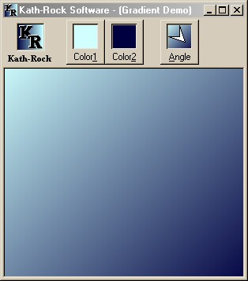



## \_SUPER FAST\! Gradient Fills \(Any Angle\) \(Updated\)

### Description

(Updated - Even Faster Now) This class will fill any Form or PictureBox with a Gradient fill starting from Color1 and blending to Color2. Sure, I know you've seen that plenty of times, but this code allows you to select any angle 0º to 359.99999º and it does a perfect blend at all angles. Use any colors, even system colors. Create multiple special effects by setting PictureBoxes next to each other and filling them in different directions. Includes full source code and sample program. PLEASE VOTE FOR ME!
 
### More Info
 
Properties:

Color1 (Long)

Color2 (Long)

Angle (Single)

Draw (Method)

Draw returns True if successful

             |
---                |---
**Submitted On**   |2000-02-26 06:46:08
**By**             |[Rocky Clark \(Kath\-Rock Software\)](https://github.com/Planet-Source-Code/PSCIndex/blob/master/ByAuthor/rocky-clark-kath-rock-software.md)
**Level**          |Intermediate
**User Rating**    |4.9 (336 globes from 69 users)
**Compatibility**  |VB 5\.0, VB 6\.0
**Category**       |[Complete Applications](https://github.com/Planet-Source-Code/PSCIndex/blob/master/ByCategory/complete-applications__1-27.md)
**World**          |[Visual Basic](https://github.com/Planet-Source-Code/PSCIndex/blob/master/ByWorld/visual-basic.md)
**Archive File**   |[CODE\_UPLOAD36222262000\.zip](https://github.com/Planet-Source-Code/rocky-clark-kath-rock-software-super-fast-gradient-fills-any-angle-updated__1-6154/archive/master.zip)

